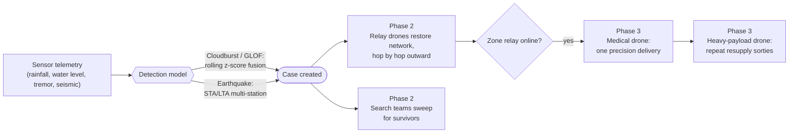
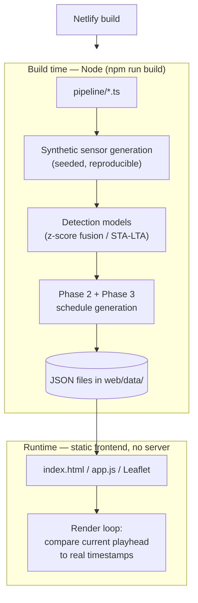
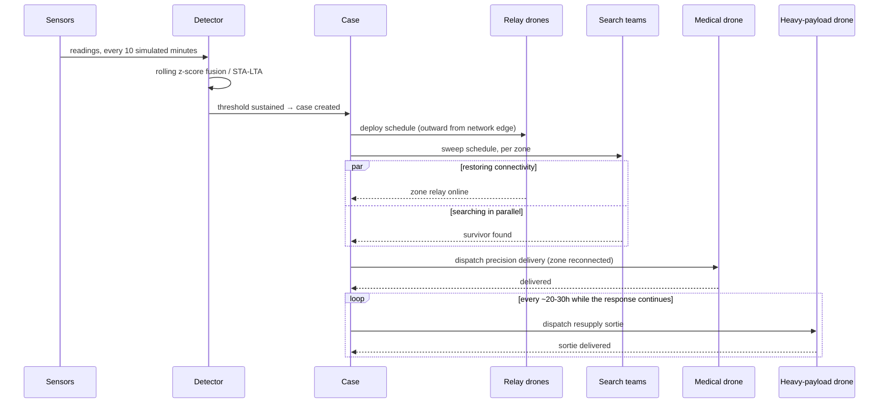

# ResQ

**A live disaster detection & response monitor** — the software core of a three-phase drone-based disaster-response concept, built end to end and running against a real event: the October 2023 Sikkim glacial lake outburst flood (South Lhonak Lake / Teesta basin), alongside a hypothetical Himalayan earthquake scenario.

## Why this exists

In the Himalayan region, the same terrain that makes disasters severe — steep river corridors, remote district towns, thin road/telecom networks — is also what makes *responding* to them slow. Cell towers along a river corridor go down with the flood that caused the emergency. Search-and-rescue teams lose contact with command exactly when coordination matters most. Relief cannot be routed to a zone until someone on the ground can report what that zone even needs.

ResQ answers a specific question: **what would it look like if the response pipeline reacted at machine speed instead of waiting on a human to notice, decide, and dispatch?** Not "can we build the drones" — that's real hardware, out of scope for a software project — but "can we prove out the *decision logic* that would drive them: when to trust a sensor reading enough to call it a disaster, in what order to restore connectivity, and how relief should follow the moment a zone is reachable again." This project is that decision layer, built as a working, live, browser-based simulation rather than a slide deck describing one.

It follows a real three-phase structure:

1. **Detection & Surveillance** — turn raw sensor telemetry into a trustworthy "yes, this is happening" signal, fast enough to matter and resistant enough to noise not to cry wolf.
2. **Search & Connectivity** — the moment a disaster is confirmed, restore network reach into the affected corridor (relay drones daisy-chaining outward) while search teams sweep for survivors in parallel.
3. **Medical & Relief Delivery** — the instant a zone is reconnected, route relief to it — first a fast precision drop, then sustained resupply for as long as the response continues.



*Detection decides; connectivity gates relief — a zone gets nothing from Phase 3 until its own Phase 2 relay is online.*

## What's real, what's simulated

Being direct about this, because it matters for how to read the project:

- **Real**: the disaster event itself (Sikkim, October 2023), the geography (actual station coordinates along the Teesta river corridor), the detection *algorithms* (rolling z-score sensor fusion; STA/LTA, the actual seismology industry standard for earthquake triggers), and the response *logic* (relay ordering, connectivity-gates-relief sequencing, resupply cadence) — none of this is arbitrary or decorative, it's runnable code that produces internally consistent, physically-sane schedules.
- **Simulated**: the sensor readings themselves (synthetic, seeded so they're reproducible) and the drones (no hardware exists or is claimed to exist — relay/medical/heavy-payload drones are a scheduling concept the pipeline reasons about, not a physical system). There is no live satellite feed, no real telecom infrastructure, no actual aircraft.

Nothing in the UI claims otherwise. Every number, marker, and status on screen is computed by comparing the current point in a simulated timeline against real generated schedule data — never scripted, never hardcoded to "look right" at a particular moment.

## How it's built

**100% TypeScript/JavaScript, one Netlify-deployable package.** No Python, no backend service, no database — a Node-based data pipeline generates everything at build time, and a static frontend plays it back.

```
web/                Netlify-deployable npm project (this is netlify.toml's build base)
  pipeline/            TypeScript: synthetic sensor generation + the detection models themselves
  data/                pipeline output (JSON) — regenerated fresh on every build
  index.html/css/js    the frontend: vanilla HTML/CSS/JS + Leaflet, no framework
  qa/                  headless-browser QA (Playwright) — 51 automated checks
  README.md            architecture deep-dive: exact algorithms, data schema, UI wiring

netlify.toml         build = "npm run build" (base: web) — Node only, nothing else to provision
```



*Nothing computed at runtime is "live" in the network sense — the frontend is static files reading pre-generated JSON. "Live" refers to the UI re-deriving its own state every frame from real timestamps, not to a network connection.*

### The pipeline — how a disaster gets detected

Two scenarios run in parallel over an identical 5-day, 10-minute-resolution timeline: a cloudburst/GLOF (modeled on the real Sikkim event) and a hypothetical earthquake. Each has its own detection model, chosen because it's what the real domain actually uses — not picked for novelty:

- **Cloudburst — rolling z-score sensor fusion**: each station compares its own live rainfall, water-level, and tremor readings against its own recent baseline, converts the anomaly into a probability via a sigmoid, and combines all three signals into one score. A disaster is called once multiple corridor stations sustain a high combined score for several consecutive readings — resistant to a single noisy spike.
- **Earthquake — STA/LTA multi-station**: the actual algorithm real seismic networks use — a short-term average of ground motion compared against a long-term baseline average, where a sudden ratio spike signals an event. Confirmed only once multiple stations trigger within a matching time window (mirroring real wave-propagation delay), so one station glitching isn't mistaken for an earthquake.

Once triggered, a **Case** is created and Phase 2/3 schedules are generated for it: which stations get a relay first (ordered outward from the working network edge), how long each search sweep takes and how many survivors it finds, when each zone's medical delivery dispatches, and how many resupply sorties fit before the simulation window ends. All of this is real generated data sitting in JSON before the UI ever runs — the frontend's only job is comparing "where is the playhead right now" against these timestamps.

### The frontend — how it stays honest to the data

The one rule the whole UI is built around: **every live number is derived by comparing the current timeline position to real timestamps, recomputed on every frame — never hardcoded, never scripted to a cue.** A relay marker appears exactly when its real `deploy_at` timestamp passes; a case's stepper shows exactly the live connectivity percentage computed against the current playhead; the "Play the Story" guided mode fires its narrated captions by watching for the same real timestamps to pass, not on a fixed clock.

On top of that live-data core, the UI is built to be understandable to someone with no prior context: a first-run intro modal and guided auto-playback, plain-language explainers next to every phase (naming what a "relay drone" or "sigmoid_k" actually means), a live-updating "what's been achieved so far" impact strip, and accessibility work (colorblind-safe shape redundancy on every status indicator, full keyboard operability, `prefers-reduced-motion` support) so the interface itself doesn't become a barrier to the thing it's trying to explain.

### How one case unfolds



*Every arrow above corresponds to a real timestamp already sitting in that case's generated schedule before the UI ever renders a frame — the frontend's only job is noticing, each tick, which of these have happened yet.*

## Getting started

```
cd web
npm install
npm run dev   # generates the synthetic data + runs detection, then serves on http://localhost:8000
npm run qa    # headless-browser QA pass (51 checks)
```

To deploy: push to a git remote and connect the repo in Netlify — `netlify.toml` handles the rest, no manual environment variables needed.

See **[web/README.md](web/README.md)** for the full architecture deep-dive: exact file-by-file pipeline responsibilities, the data schema, and precisely how every part of the UI is wired to real data.

## Scope

All three phases are complete and fully simulated end to end — detection, connectivity restoration, and relief delivery all run off real generated schedules, none of it mock or static. `data-pipeline/` (an earlier Python prototype) remains in the repo untouched but unused; the deployed project is 100% TypeScript/Node.
