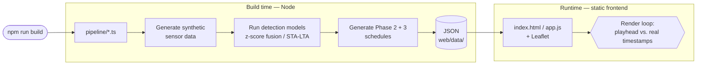
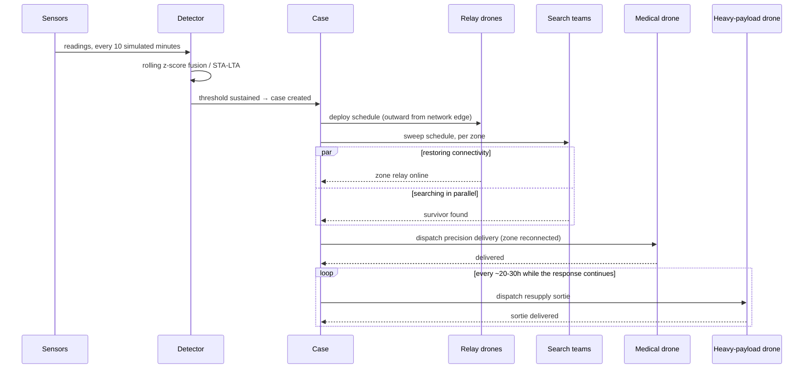

# ResQ

A live disaster detection & response monitor — the software core of a three-phase drone-based disaster-response concept, running against a real event: the October 2023 Sikkim glacial lake outburst flood, alongside a hypothetical Himalayan earthquake scenario.

## Why this exists

- Himalayan disaster corridors lose cell/network coverage exactly when it's needed most — the same flood that causes the emergency takes out the towers.
- Search-and-rescue loses contact with command at the worst possible moment; relief can't be routed to a zone until someone reports what it needs.
- The question this project answers: what if the response pipeline reacted at machine speed instead of waiting on a human to notice, decide, and dispatch?
- Not "build the drones" — that's real hardware, out of scope. This is the **decision logic**: when to trust a sensor reading, in what order to restore connectivity, how relief follows once a zone is reachable.
- Three phases:
  - **Detection & Surveillance** — turn raw telemetry into a trustworthy signal, fast and noise-resistant.
  - **Search & Connectivity** — restore network into the corridor while searching for survivors, in parallel.
  - **Medical & Relief Delivery** — relief follows the instant a zone is reconnected — a fast drop, then sustained resupply.


*Connectivity gates relief — a zone gets nothing from Phase 3 until its own Phase 2 relay is online.*

## What's real, what's simulated

- **Real**: the disaster event (Sikkim, Oct 2023), the geography (actual Teesta corridor station coordinates), the detection algorithms (rolling z-score fusion; STA/LTA — the real seismology standard), the response logic (relay ordering, connectivity-gates-relief, resupply cadence). All of it runnable code producing internally consistent, physically-sane schedules.
- **Simulated**: the sensor readings (synthetic, seeded, reproducible) and the drones (no hardware built or claimed — a scheduling concept only). No real satellite feed, telecom infrastructure, or aircraft.
- The UI never claims otherwise: every number, marker, and status is computed live against real generated schedule data — never scripted, never hardcoded to a moment.

## How it's built

- 100% TypeScript/JavaScript, one Netlify-deployable package.
- No Python, no backend service, no database — a Node pipeline generates everything at build time; a static frontend plays it back.

```
web/                Netlify-deployable npm project (netlify.toml's build base)
  pipeline/            TypeScript: synthetic sensor generation + detection models
  data/                pipeline output (JSON) — regenerated fresh every build
  index.html/css/js    the frontend: vanilla HTML/CSS/JS + Leaflet, no framework
  qa/                  headless-browser QA (Playwright) — 51 automated checks
  README.md            architecture deep-dive: algorithms, data schema, UI wiring

netlify.toml         build = "npm run build" (base: web) — Node only
```



*"Live" means the UI re-derives its own state every frame from real timestamps — not a network connection. The frontend is static files reading pre-generated JSON.*

### Detection

- Two scenarios run in parallel over an identical 5-day, 10-minute-resolution timeline.
- **Cloudburst — rolling z-score fusion**: each station compares live rainfall/water-level/tremor against its own baseline, scores the anomaly via sigmoid, combines all three signals. Triggers once multiple corridor stations sustain a high score for several readings — resistant to a single spike.
- **Earthquake — STA/LTA multi-station**: the real seismology-standard algorithm — short-term motion average vs. long-term baseline, a sudden ratio spike signals an event. Confirmed only once multiple stations trigger within a matching window.
- Once triggered, a **Case** is created with full Phase 2/3 schedules already generated: relay order, search-sweep timing and survivor counts, medical dispatch timing, resupply sortie count — all real data in JSON before the UI ever renders a frame.

### Frontend

- One rule everything is built around: every live number comes from comparing the current timeline position to real timestamps, recomputed every frame — never hardcoded, never scripted to a cue.
- Understandable with zero prior context: first-run intro modal + guided auto-playback, plain-language explainers next to every phase, a live "what's been achieved so far" impact strip.
- Accessible: colorblind-safe shape redundancy on every status indicator, full keyboard operability, `prefers-reduced-motion` support.

### How one case unfolds



*Every arrow is a real timestamp already sitting in the case's generated schedule — the frontend just notices, each tick, which have happened yet.*

## Getting started

```
cd web
npm install
npm run dev   # generates data + runs detection, serves on http://localhost:8000
npm run qa    # headless-browser QA pass (51 checks)
```

- Deploy: push to a git remote, connect the repo in Netlify — `netlify.toml` handles the rest, no manual env vars needed.
- Full architecture deep-dive: **[web/README.md](web/README.md)** — file-by-file pipeline responsibilities, data schema, exact UI-to-data wiring.

## Scope

- All three phases complete and fully simulated end to end — none of it mock or static.
- `data-pipeline/` (an earlier Python prototype) remains untouched but unused; the deployed project is 100% TypeScript/Node.
