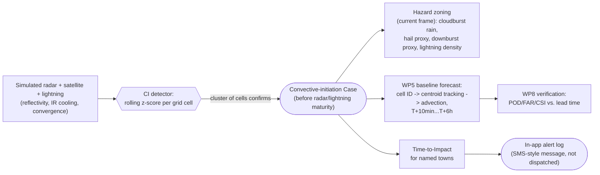

# ResQ

A live convective-storm nowcasting system — built for **SIH26084** ("Convective-scale nowcasting for Thunderstorms, Hail & Cloudbursts, 0-6hr", Ministry of Earth Sciences). Detects a storm forming *before* it matures, zones the ground for cloudburst/hail/downburst risk, and counts down time-to-impact for real towns — all SIMULATED, running against the real October 2023 Sikkim event.

A secondary "Response Module" — the project's original drone Detection → Connectivity → Relief demo — still exists unchanged, kept for reference, outside this problem statement's scope.

## Why this exists (SIH26084)

- The problem statement asks for a system that fuses radar + satellite + lightning on a common grid and flags a storm **before** it's already a storm — from cloud-top cooling and low-level convergence, ahead of reflectivity/lightning maturity.
- A concrete gap motivated this: a naive rainfall-threshold detector only fires on the *flood wave*, hours after the real rain peak — too late to be a nowcast. The convective-initiation (CI) detector exists specifically to catch the precursor signals instead.
- Four hazard outputs per the PS: lightning strike density, hail probability, downburst velocity, cloudburst rainfall threshold — computed per grid cell for the current frame.
- Real india-relevant grounding: the same October 2023 Sikkim event the project has always modeled, retold from the storm's own genesis instead of its downstream flood consequence.


```mermaid
flowchart LR
    S["Simulated radar + satellite + lightning\n(reflectivity, IR cooling, convergence)"] --> CI{{"CI detector:\nrolling z-score per grid cell"}}
    CI -->|"cluster of cells confirms"| CASE(["Convective-initiation Case\n(before radar/lightning maturity)"])
    CASE --> HZ["Hazard zoning\n(current frame): cloudburst rain,\nhail proxy, downburst proxy, lightning density"]
    CASE --> FC["WP5 baseline forecast:\ncell ID -> centroid tracking -> advection,\nT+10min...T+6h"]
    FC --> SKILL["WP8 verification:\nPOD/FAR/CSI vs. lead time"]
    CASE --> TTI["Time-to-Impact\nfor named towns"]
    TTI --> ALERT(["In-app alert log\n(SMS-style message, not dispatched)"])
```

*CI detection must fire before the storm's own ground-truth maturity time — the demo proves this with a live "N minutes before maturity" stat, not a claim.*

## What's real, what's simulated

| | Real | Simulated / proxy |
|---|---|---|
| Event | Oct 2023 Sikkim storm/flood, geography (real Teesta corridor + town coordinates) | Radar reflectivity, satellite IR, lightning flashes — no real feed |
| Detection method | Rolling z-score → sigmoid → sustained-trigger (real statistical pattern, same one used for the response module's cloudburst/earthquake models) | — |
| Cloudburst rain rate | Z-R relation (Marshall-Palmer, Z=200·R^1.6 — **not re-verified against a primary source this session, TO BE VERIFIED**) applied to simulated reflectivity | Threshold (≥100mm/hr) — **also TO BE VERIFIED against a primary IMD source** |
| Hail probability, downburst velocity | — | Explicit **PROXY** heuristics (no public labelled hail/downburst dataset for India exists to calibrate against — stated plainly in-app) |
| Lightning strike density | Direct count of simulated flashes (not a proxy) | The flashes themselves are simulated |
| Downstream GLOF flood TTI | Real formula (basin_km ÷ flood-wave speed), reused unchanged from the Response Module | — |
| Storm-cell TTI | — | Computed from this simulated event's own known track/steering vector — not a general forecast, labeled as such in the UI |
| Forecast lead time (T+10min…T+6h) | **WP5 baseline nowcast is real**: cell identification (≥40dBZ) → reflectivity-weighted centroid tracking → velocity + trend estimated only from observed history → advection extrapolation | Only reflectivity is forecast (not the other layers); genuinely has no data for most (base-frame, lead) pairs — the UI says so honestly rather than fabricating one |
| Forecast skill (WP8) | **Real POD/FAR/CSI**, scored against this scenario's own simulated future | Scored against SIMULATED ground truth, not real-world observations — stated in the verification panel itself |
| Real data-source adapters (INSAT, IMD DWR, lightning network) | Documented interface + schema (`web/pipeline/sources/`) | Stubs only — not wired to any live feed; access terms marked TO BE VERIFIED |
| SMS alert dispatch | Documented Netlify Function stub (`web/netlify/functions/send-alert.mjs`), env-flag gated | Off by default everywhere, including deployed — no env vars are set, and the frontend never calls it; the in-app Alert Log is what's actually live |

## How it's built

- 100% TypeScript/JavaScript, one Netlify-deployable package. No Python, no backend, no database.
- Convective nowcast and Response Module share one build-time pipeline and one 720-frame, 10-minute-resolution timeline — the storm is generated on the identical time grid as the flood/earthquake scenarios, so one playhead drives all three.

```
web/                Netlify-deployable npm project (netlify.toml's build base)
  pipeline/            TypeScript: sensor + storm generation, detection models, hazards, TTI
    sources/             documented real-data-adapter interface — stubs only, not wired
  data/                pipeline output (JSON) — regenerated fresh every build
  index.html/css/js    the frontend: vanilla HTML/CSS/JS + Leaflet, no framework
  qa/                  headless-browser QA (Playwright) — 77 automated checks
  README.md            architecture deep-dive: algorithms, data schema, UI wiring

netlify.toml         build = "npm run build" (base: web) — Node only
```

### Convective initiation (CI) detection

- A ~1.5km grid over the same real geography the Response Module already uses.
- A single seeded storm scenario re-tells Oct 3-4, 2023 as a convective cloudburst over the upper Teesta — cloud-top cooling and low-level convergence begin ~2-3 hours before the storm's own reflectivity/lightning maturity.
- Per grid cell: rolling z-score of cooling rate + convergence, an **adaptive per-cell threshold** calibrated from that cell's own quiet-period noise (the same calibration idea already proven in the Response Module's cloudburst/earthquake models), sigmoid → probability.
- A small cluster of neighboring cells (≥3) must confirm together — the spatial equivalent of "multiple stations must agree."
- On confirmation: a Case is created, with a live "detected N minutes before maturity" stat computed against the storm's own ground-truth maturity timestamp.

### WP5 baseline forecast + WP8 verification

- Cell identification: any grid cell reaching ≥40dBZ reflectivity in the observed data.
- Centroid tracking: a reflectivity-weighted centroid computed fresh at each identified frame, from *observed* cells only — never from the simulator's own hidden ground-truth track (that field exists solely for the CI-lead-time proof and TTI, both already clearly labeled as reading known ground truth).
- Velocity + trend: estimated from the two most recent identified frames only — a real baseline never knows the future, so it can't and doesn't peek at how the storm actually evolves next.
- Extrapolation: shift the centroid by velocity × lead time, decay/grow peak intensity by the observed trend (clamped to a sane range), hold the footprint radius roughly constant — the "simple lifecycle growth/decay term" the brief calls for.
- Verification: forecast cells (≥40dBZ) vs. the scenario's actual future cells at the same threshold, aggregated per lead time into POD/FAR/CSI. Skill genuinely decays — from ~55% CSI at T+10min down to 0% by around T+60min, because this particular simulated storm only lives ~2-3 hours, so a 6-hour-ahead forecast for it has nothing left to be right about by then. That's an honest property of a short-lived event, not a tuning failure.

### Frontend

- Nowcast is the default view: a grid canvas layer (toggle between reflectivity, convergence, cloud-top cooling, CI probability, and current-frame hazard zoning), a Convective Initiation status panel, a Time-to-Impact panel per named town, an in-app alert log, and a Forecast Verification panel.
- The lead-time slider (T+0…T+6h) shows the real WP5 forecast when one exists for the current (base frame, lead) pair, and an honest "no forecast available" note otherwise — never a fabricated number either way.
- Response Module (station map, cloudburst/earthquake cases, drone Phase 1-3) is one nav tab away, fully intact, clearly labeled legacy.
- Accessible: colorblind-safe shape redundancy, full keyboard operability, `prefers-reduced-motion` support — carried over to every new control.

## Getting started

```
cd web
npm install
npm run dev   # generates data + runs detection, serves on http://localhost:8000
npm run qa    # headless-browser QA pass (77 checks)
```

- Deploy: push to a git remote, connect the repo in Netlify — `netlify.toml` handles the rest, no manual env vars needed.
- Full architecture deep-dive: **[web/README.md](web/README.md)** — file-by-file pipeline responsibilities, data schema, exact UI-to-data wiring.

## Scope

**Built (Milestone 1 + WP5/WP8):** grid + time-axis structure, the simulated storm scenario, CI detection with a live before-maturity proof, current-frame hazard zoning (cloudburst/hail-proxy/downburst-proxy/lightning-density), the WP5 baseline forecast (cell ID → centroid tracking → advection extrapolation, T+10min…T+6h, observed-data-only — never peeks at ground truth), WP8 verification (real POD/FAR/CSI vs. lead time, scored against this scenario's own simulated future), downstream GLOF flood TTI (real) + storm-cell TTI (from simulated ground truth) + in-app alert log, a documented off-by-default SMS dispatch stub (`web/netlify/functions/send-alert.mjs`), and the full original Response Module (drone Detection → Connectivity → Relief), unchanged.

**Deferred to a future milestone (documented, not built):**
- The *general* case of WP5 — real multi-frame vision-based object tracking (as opposed to the simple centroid-tracking baseline, which is done) — and any ConvLSTM/U-Net model; the brief only asks for the ML tier if it beats the baseline, and there's no real training data here to justify attempting it.
- Live SMS dispatch actually reaching Twilio — the adapter stub exists and is env-flag gated, but the flag is unset everywhere by default, and the frontend never calls it.
- Real INSAT/IMD-DWR/lightning-network data ingestion — `web/pipeline/sources/` documents the interface but every loader is a stub.
